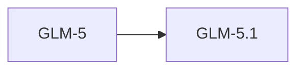

# GLM-5.1

> 智谱 AI 当前最新旗舰模型，754B 参数，支持 Thinking 模式。

## 基本信息

| 属性 | 值 |
|------|-----|
| 厂商 | Z.ai (Zhipu AI) |
| 发布日期 | 2026-04-07 |
| 层级 | 旗舰（当前最新） |
| 参数量 | 754B |
| 许可证 | MIT |

## 核心能力

- **Thinking 模式**：支持深度思考模式，推理能力大幅提升
- **大规模参数**：754B 参数，知识容量巨大
- **MIT 许可证**：完全开源，商用友好

## 版本链

- 前序：[[GLM-5]]

## 使用场景

- 复杂推理任务（Thinking 模式）
- 数学与逻辑推理
- 代码生成与分析
- 企业级应用

## 对比

| 模型 | 厂商 | 特点 |
|------|------|------|
| GLM-5.1 | Z.ai | Thinking 模式，754B |
| Qwen 3.7 Max | Alibaba | 推理旗舰 |
| Kimi K2.6 | Moonshot AI | 最新旗舰 |

## 参考资料

- [智谱 AI 官方文档](https://open.bigmodel.cn/)
- [Hugging Face - GLM](https://huggingface.co/THUDM)
