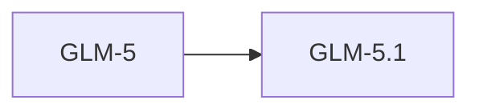

# GLM-5

> 智谱 AI 旗舰模型，754B 参数，MIT 许可证开源。

## 基本信息

| 属性 | 值 |
|------|-----|
| 厂商 | Z.ai (Zhipu AI) |
| 发布日期 | 2026-02-12 |
| 层级 | 旗舰 |
| 参数量 | 754B |
| 许可证 | MIT |

## 核心能力

- **大规模参数**：754B 参数，知识容量巨大
- **MIT 许可证**：完全开源，商用友好
- **中文优势**：中文理解与生成能力领先

## 版本链

- 后续：[[GLM-5.1]]

## 使用场景

- 复杂推理任务
- 中文内容创作
- 开源社区研究
- 企业私有化部署

## 对比

| 模型 | 厂商 | 参数量 | 许可证 |
|------|------|--------|--------|
| GLM-5 | Z.ai | 754B | MIT |
| Kimi K2.5 | Moonshot AI | 1040B | MIT |
| Qwen 3 | Alibaba | 235B MoE | Apache 2.0 |

## 参考资料

- [智谱 AI 官方文档](https://open.bigmodel.cn/)
- [Hugging Face - GLM](https://huggingface.co/THUDM)
