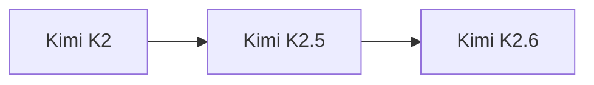

# Kimi K2.5

> Moonshot AI 旗舰模型，1040B 参数，15T tokens 训练数据，MIT 许可证。

## 基本信息

| 属性 | 值 |
|------|-----|
| 厂商 | Moonshot AI |
| 发布日期 | 2026-01-27 |
| 层级 | 旗舰 |
| 参数量 | 1040B |
| 训练数据 | 15T tokens |
| 许可证 | MIT |

## 核心能力

- **大规模参数**：1040B 参数，知识容量巨大
- **海量训练数据**：15T tokens 训练，覆盖广泛
- **MIT 许可证**：完全开源，商用友好

## 版本链

- 前序：[[Kimi K2]]
- 后续：[[Kimi K2.6]]

## 使用场景

- 开源社区研究与微调
- 复杂推理与分析
- 企业私有化部署
- 多语言任务

## 对比

| 模型 | 厂商 | 参数量 | 许可证 |
|------|------|--------|--------|
| Kimi K2.5 | Moonshot AI | 1040B | MIT |
| GLM-5 | Z.ai | 754B | MIT |
| Llama 4 | Meta | - | Llama License |

## 参考资料

- [Moonshot AI 官方文档](https://platform.moonshot.cn/)
- [Hugging Face - Moonshot](https://huggingface.co/moonshotai)
