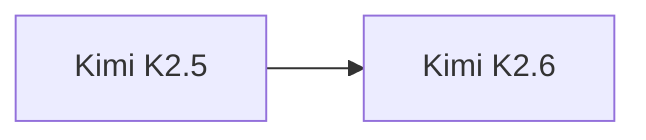

# Kimi K2.6

> Moonshot AI 当前最新旗舰模型。

## 基本信息

| 属性 | 值 |
|------|-----|
| 厂商 | Moonshot AI |
| 发布日期 | 2026-04 |
| 层级 | 旗舰（当前最新） |

## 核心能力

- **推理增强**：在 K2.5 基础上进一步提升推理能力
- **长上下文**：延续 Kimi 系列长上下文优势
- **综合能力**：代码、数学、创作全面升级

## 版本链

- 前序：[[Kimi K2.5]]

## 使用场景

- 复杂推理任务
- 代码生成与分析
- 长文档处理
- 企业级应用

## 对比

| 模型 | 厂商 | 特点 |
|------|------|------|
| Kimi K2.6 | Moonshot AI | 最新旗舰 |
| Qwen 3.7 | Alibaba | 推理旗舰 |
| GLM-5.1 | Z.ai | Thinking 模式 |

## 参考资料

- [Moonshot AI 官方文档](https://platform.moonshot.cn/)
