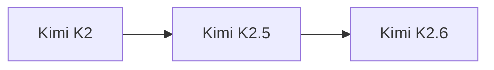

# Kimi K2

> Moonshot AI 旗舰模型，1040B 参数规模。

## 基本信息

| 属性 | 值 |
|------|-----|
| 厂商 | Moonshot AI |
| 发布日期 | 2025-07 |
| 层级 | 旗舰 |
| 参数量 | 1040B |

## 核心能力

- **大规模参数**：1040B 参数，强大的知识容量
- **长上下文**：延续 Kimi 系列长上下文优势
- **中文能力**：中文理解与生成能力出色

## 版本链

- 后续：[[Kimi K2.5]]

## 使用场景

- 复杂推理任务
- 长文档分析
- 中文内容创作
- 企业级应用

## 对比

| 模型 | 厂商 | 参数量 |
|------|------|--------|
| Kimi K2 | Moonshot AI | 1040B |
| GLM-5 | Z.ai | 754B |
| Qwen 3 | Alibaba | 235B MoE |

## 参考资料

- [Moonshot AI 官方文档](https://platform.moonshot.cn/)
