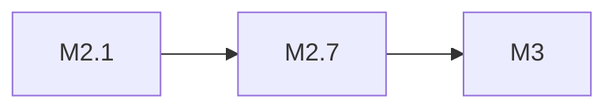

# MiniMax M2.1

> MiniMax 中端模型，适合日常对话与轻量级任务。

## 基本信息

| 属性 | 值 |
|------|-----|
| 厂商 | MiniMax |
| 发布日期 | 2026-02 |
| 层级 | 中端 |

## 核心能力

- 中文对话能力
- 轻量级推理
- 快速响应

## 版本链

- 后续：[[MiniMax M2.7]]

## 使用场景

- 日常对话
- 内容创作
- 轻量级问答

## 对比

| 模型 | 厂商 | 层级 |
|------|------|------|
| MiniMax M2.1 | MiniMax | 中端 |
| Qwen 3.5 | Alibaba | 开源 |
| Gemma 3 | Google | 开源 |

## 参考资料

- [MiniMax 官方文档](https://www.minimaxi.com/)
