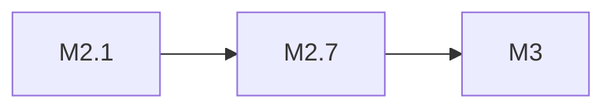

# MiniMax M2.7

> 100K 输入/20K 输出，同级最大上下文

## 基本信息

| 属性 | 值 |
|------|-----|
| 厂商 | MiniMax |
| 发布日期 | 2026-04 |
| 层级 | 中端 |
| 输入上下文 | 100K |
| 输出上下文 | 20K |

## 核心能力

- **超长输入**：100K token 输入上下文，同级最大
- **长输出**：20K token 输出，适合长文生成
- **中文优化**：针对中文场景深度优化

## 版本链

- 前序：[[MiniMax M2.1]]
- 后续：[[MiniMax M3]]

## 使用场景

- 长文档分析与总结
- 大规模文本处理
- 长文创作
- 多轮深度对话

## 对比

| 模型 | 厂商 | 上下文 |
|------|------|--------|
| MiniMax M2.7 | MiniMax | 100K 输入 / 20K 输出 |
| Gemini 3.5 Flash | Google | 1.05M |
| Grok 4.3 | xAI | 2M |

## 参考资料

- [MiniMax 官方文档](https://www.minimaxi.com/)
