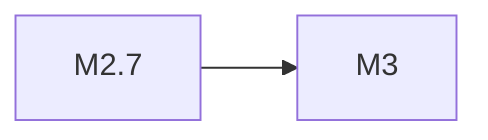

# MiniMax M3

> MiniMax 最新模型，开源权重

## 基本信息

| 属性 | 值 |
|------|-----|
| 厂商 | MiniMax |
| 发布日期 | 2026-06-04 |
| 层级 | 最新 |
| 开源 | 是（权重开放） |

## 核心能力

- **超长上下文**：继承 MiniMax 系列长上下文优势
- **开源权重**：模型权重完全开放，支持社区微调与部署
- **综合提升**：在推理、代码、创作等方面全面升级

## 版本链

- 前序：[[MiniMax M2.7]]

## 使用场景

- 开源社区研究与微调
- 长文档处理
- 企业私有化部署
- 多模态任务

## 对比

| 模型 | 厂商 | 特点 |
|------|------|------|
| MiniMax M3 | MiniMax | 开源权重，超长上下文 |
| Qwen 3.7 | Alibaba | 推理旗舰 |
| MiMo-V2.5 | Xiaomi | 万亿参数 |

## 参考资料

- [MiniMax 官方文档](https://www.minimaxi.com/)
- [Hugging Face - MiniMax](https://huggingface.co/MiniMaxAI)
