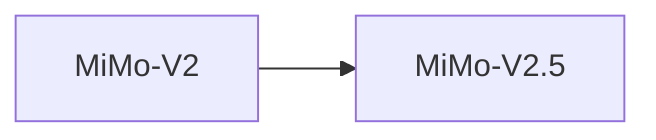

# 小米 MiMo-V2.5

> MiMo-V2.5-Pro 万亿参数级别

## 基本信息

| 属性 | 值 |
|------|-----|
| 厂商 | Xiaomi |
| 发布日期 | 2026-04-27 |
| 层级 | 旗舰 |
| 许可证 | MIT |
| Pro 参数量 | 1.02T |
| Pro 训练数据 | 48T tokens |
| 标准参数量 | 310B |

## 核心能力

- **万亿参数**：Pro 版本达到 1.02T 参数，知识容量极大
- **海量训练数据**：48T tokens 训练数据
- **MIT 许可证**：完全开源，商用友好
- **双版本**：Pro（1.02T）与标准（310B）满足不同需求

## 版本链

- 前序：[[小米 MiMo-V2]]

## 使用场景

- 复杂推理与分析
- 开源社区研究
- 企业私有化部署
- 多模态任务

## 对比

| 模型 | 厂商 | 参数量 | 许可证 |
|------|------|--------|--------|
| MiMo-V2.5 Pro | Xiaomi | 1.02T | MIT |
| Kimi K2.5 | Moonshot AI | 1040B | MIT |
| GLM-5.1 | Z.ai | 754B | MIT |

## 参考资料

- [小米 AI 官方文档](https://dev.mi.com/)
- [Hugging Face - Xiaomi](https://huggingface.co/Xiaomi)
