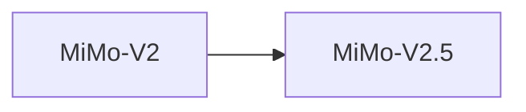

# 小米 MiMo-V2

> 小米 Omni 多模态模型，支持多种模态输入输出。

## 基本信息

| 属性 | 值 |
|------|-----|
| 厂商 | Xiaomi |
| 发布日期 | 2026-03 |
| 层级 | Omni多模态 |
| 版本 | 标准版 / Pro 版 |

## 核心能力

- **Omni 多模态**：支持文本、图像、音频、视频等多种模态
- **Pro 版本**：更强的推理与生成能力
- **端侧优化**：适配小米设备端侧部署

## 版本链

- 后续：[[小米 MiMo-V2.5]]

## 使用场景

- 多模态理解与生成
- 智能设备交互
- 图像/视频分析
- 语音助手

## 对比

| 模型 | 厂商 | 特点 |
|------|------|------|
| MiMo-V2 | Xiaomi | Omni 多模态 |
| Qwen 3.5 | Alibaba | Omni 多模态 |
| Gemini | Google | 原生多模态 |

## 参考资料

- [小米 AI 官方文档](https://dev.mi.com/)
