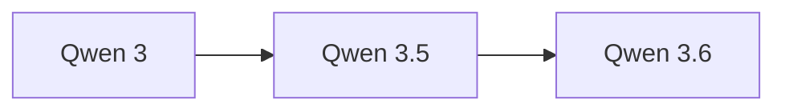

# Qwen 3.5

> Qwen3.5-9B 性能超越 120B 模型

## 基本信息

| 属性 | 值 |
|------|-----|
| 厂商 | Alibaba |
| 发布日期 | 2026-02 |
| 层级 | 开源 |
| 参数范围 | 0.8B ~ 122B |
| 多模态 | Omni 多模态 |

## 核心能力

- **多尺寸**：从 0.8B 到 122B 全尺寸覆盖，适配端侧到云端
- **Omni 多模态**：支持文本、图像、音频等多种模态输入输出
- **效率突破**：小模型性能大幅超越大参数模型

## 版本链

- 前序：[[Qwen 3]]
- 后续：[[Qwen 3.6]]

## 使用场景

- 端侧部署（0.8B 轻量版）
- 多模态理解与生成
- 高性价比云端推理
- 中文场景优先的任务

## 对比

| 模型 | 厂商 | 特点 |
|------|------|------|
| Qwen 3.5 | Alibaba | 小模型大能力，Omni 多模态 |
| Llama 4 Scout | Meta | 109B 激活，17B 活跃 |
| Gemma 3 | Google | 轻量开源，多模态 |

## 参考资料

- [Qwen3.5 技术博客](https://qwenlm.github.io/blog/)
- [Hugging Face - Qwen3.5](https://huggingface.co/Qwen)
