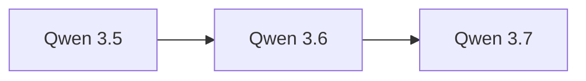

# Qwen 3.6

> 阿里 Qwen 系列迭代更新，MoE 架构进一步优化。

## 基本信息

| 属性 | 值 |
|------|-----|
| 厂商 | Alibaba |
| 发布日期 | 2026-04-15 |
| 层级 | 开源 |
| 架构 | MoE |
| 参数量 | 35B-A3B / 27B / Max Preview |

## 核心能力

- **MoE 架构**：35B 总参数、3B 激活参数，高效推理
- **多尺寸**：27B 密集模型和 Max Preview 版本
- **性能提升**：在多项基准测试中持续改进

## 版本链

- 前序：[[Qwen 3.5]]
- 后续：[[Qwen 3.7]]

## 使用场景

- 高效推理场景（MoE 低激活参数）
- 中文内容理解与生成
- 企业级应用部署
- 多模态任务

## 对比

| 模型 | 厂商 | 特点 |
|------|------|------|
| Qwen 3.6 | Alibaba | MoE 35B-A3B，高效 |
| DeepSeek V4 | DeepSeek | 价格最低 |
| MiMo-V2.5 | Xiaomi | 万亿参数级 |

## 参考资料

- [Qwen 官方博客](https://qwenlm.github.io/blog/)
- [Hugging Face - Qwen](https://huggingface.co/Qwen)
