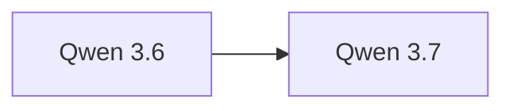

# Qwen 3.7

> 阿里 Qwen 系列当前最新旗舰模型，Max 推理旗舰与 Plus 通用双线并行。

## 基本信息

| 属性 | 值 |
|------|-----|
| 厂商 | Alibaba |
| 发布日期 | 2026-05 |
| 层级 | 旗舰（当前最新） |
| 版本 | Max（推理旗舰）/ Plus（通用） |

## 核心能力

- **Max 推理旗舰**：深度推理能力，数学/编程/逻辑推理领先
- **Plus 通用**：均衡的通用能力，适合日常对话与创作
- **中文优势**：延续 Qwen 系列中文能力领先的传统

## 版本链

- 前序：[[Qwen 3.6]]
- 后续：待发布

## 使用场景

- 复杂推理任务（Max 版本）
- 日常对话与创作（Plus 版本）
- 中文优先的企业应用
- 代码生成与技术分析

## 对比

| 模型 | 厂商 | 特点 |
|------|------|------|
| Qwen 3.7 Max | Alibaba | 推理旗舰 |
| Claude Opus 4.8 | Anthropic | SWE-bench 69.2% |
| GPT-5.5 | OpenAI | Terminal-Bench 82.7% |

## 参考资料

- [Qwen 官方文档](https://qwenlm.github.io/)
- [Hugging Face - Qwen](https://huggingface.co/Qwen)
