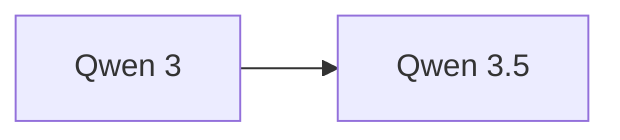

# Qwen 3

> 阿里巴巴开源旗舰模型，多尺寸 MoE 架构，中文能力优秀。

## 基本信息

| 属性 | 值 |
|------|-----|
| 厂商 | Alibaba |
| 发布日期 | 2025-04 |
| 层级 | 开源旗舰 |
| 架构 | MoE |
| 最大参数量 | 235B |

## 核心能力

- **多尺寸**：提供多种参数规模，适配不同部署场景
- **中文优秀**：中文理解与生成能力业界领先
- **MoE 架构**：235B 参数的混合专家架构，推理效率高

## 版本链

- 前序：Qwen 2.5
- 后续：[[Qwen 3.5]]

## 使用场景

- 中文内容创作与翻译
- 企业级对话与客服
- 代码生成与辅助开发
- 多语言理解与推理

## 对比

| 模型 | 厂商 | 优势 |
|------|------|------|
| Qwen 3 | Alibaba | 中文强、MoE 高效 |
| DeepSeek V3 | DeepSeek | 性价比极高 |
| Llama 4 | Meta | 英文生态丰富 |

## 参考资料

- [Qwen 官方文档](https://qwenlm.github.io/)
- [Hugging Face - Qwen](https://huggingface.co/Qwen)
